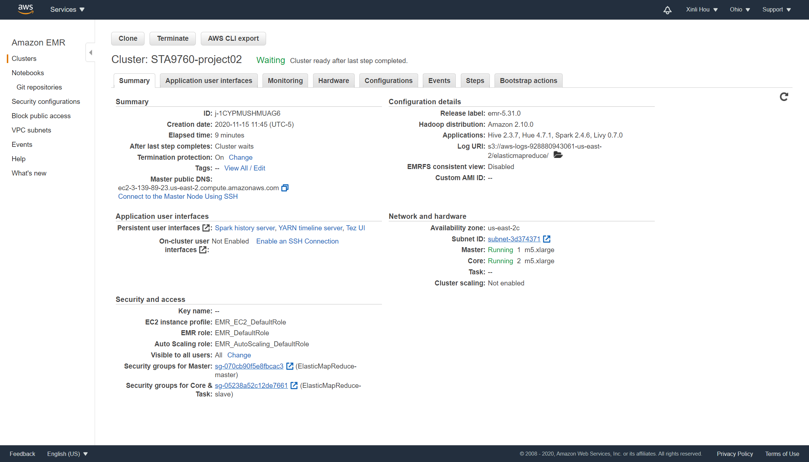
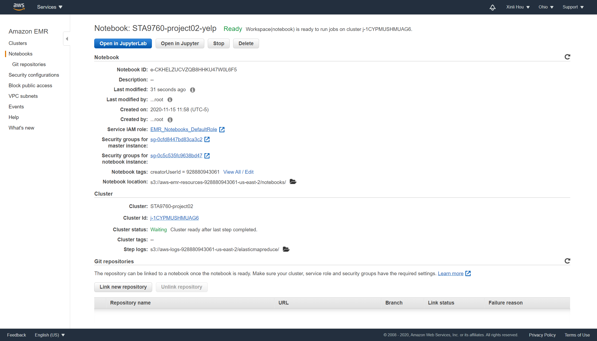

# Analyzing 10Gb of Yelp Reviews Data

For this project, I provisioned a Spark Cluster on AWS EMR for loading data and ran some analysis on Yelp’s Reviews, Businesses and Users dataset (about 10gb) from **[Kaggle](https://www.kaggle.com/yelp-dataset/yelp-dataset)**.  

**Here are steps: **

* download dataset from **[Kaggle](https://www.kaggle.com/yelp-dataset/yelp-dataset)** and pull all json files into a S3 bucket.
* create a Spark cluster on AWS EMR and connect it to a Jupyter notebook.
* in the notebook, read the Yelp data from S3 and then run a series of queries (in python with DataFrame API or **[Spark SQL](https://spark.apache.org/docs/latest/api/python/pyspark.sql.html)**).

## Cluster and Notebook Configurations

### Cluster Configuration

### Notebook Configuration

